# Entity Relationship Diagram

This is the target logical model. The first migration will implement the V1 subset described in `SCHEMA-V1.md`. Every business-owned table is scoped by `business_id`; application services validate that all related rows share that owner.

```mermaid
erDiagram
  BUSINESSES ||--o{ DEPARTMENTS : owns
  BUSINESSES ||--o{ LOCATIONS : owns
  BUSINESSES ||--o{ USERS : employs
  BUSINESSES ||--o{ ROLES : defines
  ROLES ||--o{ ROLE_PERMISSIONS : grants
  PERMISSIONS ||--o{ ROLE_PERMISSIONS : included
  USERS ||--o{ USER_ROLES : assigned
  ROLES ||--o{ USER_ROLES : assigned
  BUSINESSES ||--o{ CATEGORIES : defines
  DEPARTMENTS ||--o{ DEPARTMENT_CATEGORIES : uses
  CATEGORIES ||--o{ DEPARTMENT_CATEGORIES : used_by
  BUSINESSES ||--o{ UNITS : defines
  BUSINESSES ||--o{ SELLABLE_ITEMS : offers
  SELLABLE_ITEMS ||--o| PRODUCTS : product_detail
  SELLABLE_ITEMS ||--o| SERVICES : service_detail
  SELLABLE_ITEMS ||--o{ DEPARTMENT_SELLABLES : available_in
  DEPARTMENTS ||--o{ DEPARTMENT_SELLABLES : offers
  PRODUCTS ||--o{ PRODUCT_PACKAGING : packaged_as
  UNITS ||--o{ PRODUCT_PACKAGING : uses
  PRODUCTS ||--o{ RECIPES : output
  SERVICES ||--o{ RECIPES : optional_consumption
  RECIPES ||--o{ RECIPE_ITEMS : contains
  PRODUCTS ||--o{ RECIPE_ITEMS : ingredient
  BUSINESSES ||--o{ SUPPLIERS : owns
  SUPPLIERS ||--o{ PURCHASES : supplies
  PURCHASES ||--|{ PURCHASE_ITEMS : contains
  PRODUCTS ||--o{ PURCHASE_ITEMS : purchased
  BUSINESSES ||--o{ INVENTORY_BALANCES : caches
  PRODUCTS ||--o{ INVENTORY_BALANCES : balanced
  LOCATIONS ||--o{ INVENTORY_BALANCES : stores
  PRODUCTS ||--o{ INVENTORY_MOVEMENTS : moved
  LOCATIONS ||--o{ INVENTORY_MOVEMENTS : at
  INVENTORY_TRANSFERS ||--|{ INVENTORY_MOVEMENTS : creates
  STOCK_COUNTS ||--|{ STOCK_COUNT_ITEMS : contains
  STOCK_COUNT_ITEMS ||--o| INVENTORY_MOVEMENTS : adjusts
  WASTAGE ||--|{ INVENTORY_MOVEMENTS : creates
  BUSINESSES ||--o{ TERMINALS : owns
  DEPARTMENTS ||--o{ TERMINALS : defaults
  LOCATIONS ||--o{ TERMINALS : defaults
  USERS ||--o{ SHIFTS : operates
  TERMINALS ||--o{ SHIFTS : hosts
  BUSINESSES ||--o{ CUSTOMERS : owns
  BUSINESSES ||--o{ SALES : records
  CUSTOMERS ||--o{ SALES : places
  SHIFTS ||--o{ SALES : includes
  SALES ||--|{ SALE_ITEMS : contains
  SELLABLE_ITEMS ||--o{ SALE_ITEMS : snapshots
  SALES ||--|{ PAYMENTS : settled_by
  SALES ||--o{ REFUNDS : reversed_by
  REFUNDS ||--|{ REFUND_ITEMS : contains
  SALE_ITEMS ||--o{ REFUND_ITEMS : reverses
  REFUNDS ||--|{ REFUND_PAYMENTS : allocates
  PAYMENTS ||--o{ REFUND_PAYMENTS : reverses
  BUSINESSES ||--o{ EXPENSE_CATEGORIES : defines
  EXPENSE_CATEGORIES ||--o{ EXPENSES : classifies
  BUSINESSES ||--o{ AUDIT_LOGS : records
  BUSINESSES ||--o{ SETTINGS : configures
```

## Cardinality and constraints

- A sellable is exactly one product or service, enforced by type plus detail-row service validation.
- Products and categories, sellables and departments, users and roles, and departments and locations are many-to-many where applicable.
- A recipe belongs to either a product output or service consumable configuration. Recipe items consume products; sub-recipes are deferred but IDs do not prevent adding a component type later.
- A completed sale has one or more lines and payments whose allocated amounts equal amount due.
- Inventory movement is the ledger. `inventory_balances` is a transactionally maintained cache uniquely keyed by business, product and location.
- Unique per business: department name, location name, category name, username, role name, terminal name, unit code, sale number, purchase number, and non-null barcode/SKU/product code.
- Principal lookup indexes begin with `business_id`. Event indexes include `(business_id, occurred_at)`, sales include department/status/time, and movements include product/location/time.
- Historical references use `RESTRICT`; optional descriptive references use `SET NULL`; only uncommitted child aggregates may cascade from their draft parent.
